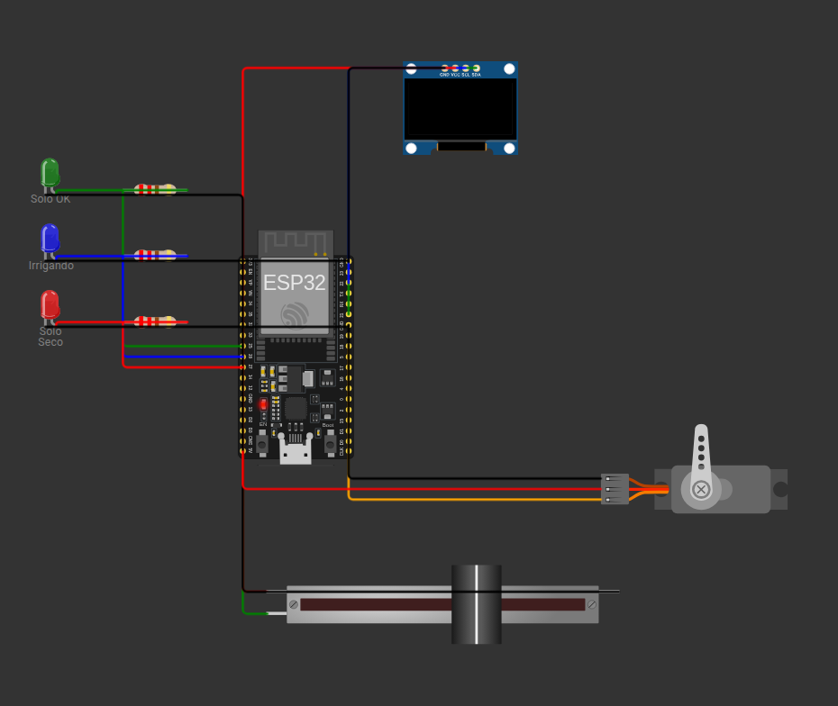

# 🌱 Sistema de Irrigação Automática



## Identificação do Candidato

- **Nome completo:** Alan Mendes Vieira
- **Github:** https://github.com/alan-mendes-ufca
---

## 1. 🗺️ Visão Geral da Solução

O projeto implementa um sistema de irrigação automático, embarcado, usando ESP32 no Wokwi. De início, monitora-se a umidade do solo; se é identificado que está seco, aciona uma válvula simulada por servo motor; após a alteração do estado, a válvula é fechada.

Fluxo de comportamento:
`MONITORANDO -> SOLO_SECO -> IRRIGANDO -> AGUARDANDO`

> **OBS**: Na simulação, a leitura analógica de umidade é representada por um potenciômetro deslizante, utilizado como substituto do sensor de umidade para simular o comportamento em um ambiente virtual.

---

## 2. 🏗️ Arquitetura do Sistema Embarcado

O arquivo `src/main.py` inicializa o monitoramento definindo o tempo atual (ticks) e passando para o `src/controller.py`, responsável de executar o fluxo de comportamento descrito anteriormente.

**Arquitetura lógica:**

- `read_soil_percent()`: lê o ADC e converte para percentual de 0 a 100.
- `set_leds(state)`: controla a sinalização visual de acordo com o estado atual.
- `set_valve(opened)`: abre ou fecha a válvula simulada pelo servo.
- `update_display(state, humidity)`: atualiza o OLED com umidade, estado e mensagem de status.
- `handle_state(now, humidity)`: centraliza as transições da máquina de estados.

**Comportamento por estado:**

- `MONITORANDO`: solo em faixa aceitável, LED verde ligado, leituras periódicas ativas.
- `SOLO_SECO`: LED vermelho ligado, display alerta solo seco e inicia temporização curta de confirmação.
- `IRRIGANDO`: servo abre a válvula e LED azul indica irrigação em andamento.
- `AGUARDANDO`: servo fecha a válvula e o sistema espera a estabilização da leitura antes de decidir o próximo passo.

---

## 3. 🔌 Componentes Utilizados na Simulação

- **ESP32 DevKit C V4**: microcontrolador principal da simulação.
- **Potenciômetro deslizante**: substitui o sensor de umidade do solo, fornecendo sinal analógico ajustável no Wokwi.
- **Servo motor**: representa a abertura e o fechamento da válvula de água.
- **LED verde**: indica condição de solo monitorado e dentro da faixa esperada.
- **LED vermelho**: indica estado de solo seco.
- **LED azul**: indica irrigação ativa.
- **Display OLED SSD1306 I2C**: exibe umidade atual, estado do sistema e mensagem curta de operação.
- **Resistores de 220 ohms**: limitam a corrente dos LEDs.

**Mapeamento principal:**

- ADC do sensor em `GPIO34`
- Servo em `GPIO18`
- LED verde em `GPIO25`
- LED azul em `GPIO26`
- LED vermelho em `GPIO27`
- OLED I2C em `GPIO21` (SDA) e `GPIO22` (SCL)

---

## 4. 🧠 Decisões Técnicas Relevantes

As decisões de implementação buscaram equilibrar qualidade, simplicidade e clareza:

- Lógica comportamental visível ao utilizador por meio de LEDs (Verde, Azul e Vermelho), tela OLED e logs no terminal.
- Temporização com `ticks_ms()` em vez de `sleep()` longo, evitando travamentos do loop principal.
- Uso de boas práticas de programação, mantendo o código legível e intuitivo.

---

## 5. ✅ Resultados Obtidos

O sistema final atende ao objetivo funcional proposto:

- Inicializa corretamente na simulação.
- Lê o valor analógico de umidade continuamente.
- Exibe o percentual de umidade no OLED.
- Transita entre os estados definidos conforme a leitura e os tempos de controle.
- Aciona os LEDs com sinalização coerente.
- Abre e fecha a válvula simulada por servo motor.
- Mantém a execução principal responsiva por não depender de delays bloqueantes longos.

---

## 6. 💬 Comentários Adicionais

**Principais limitações e observações:**

- O Wokwi não oferece um sensor de umidade do solo dedicado com o mesmo nível de suporte dos componentes analógicos padrão; por isso foi usado um potenciômetro deslizante como substituto funcional.
- A calibração do limiar foi mantida fixa no código para simplificar a simulação e reduzir risco de erro.

**Principais aprendizados:**

- A máquina de estados é uma estratégia adequada para sistemas embarcados que precisam reagir a eventos e tempo sem bloquear o loop.
- A integração entre firmware, circuito e pipeline automatizado é tão importante quanto o comportamento isolado do código.

---

## 7. 🚀 Passo a Passo para Executar o Projeto

1. Clone o repositório e acesse a pasta do projeto.
2. Faça uma validação rápida dos arquivos principais:

```bash
python3 -m py_compile src/main.py src/config.py src/display.py src/hardware.py src/controller.py
python3 -m unittest discover -s tests -p "test_*.py" -v
python3 -m json.tool diagram.json >/dev/null
```

3. Gere o arquivo `fs.bin`, necessário para a simulação com MicroPython:

```bash
docker build -t esp32-builder -f Dockerfile .
docker rm -f esp32-fs-builder 2>/dev/null || true
docker run --name esp32-fs-builder esp32-builder /bin/bash
docker cp esp32-fs-builder:/fs.bin .
docker rm esp32-fs-builder
```

4. Para visualizar o circuito no navegador, acesse `https://wokwi.com`, crie um projeto ESP32 e utilize os arquivos `diagram.json` e `src/main.py` como base da simulação.
5. Para usar a extensão do VS Code, instale a extensão oficial do Wokwi, gere o `fs.bin` com os comandos anteriores e execute o comando `Wokwi: Start Simulator`.
6. Para validar no GitHub Actions, configure o secret `WOKWI_API_KEY`, faça commit das alterações e envie para o branch remoto.
